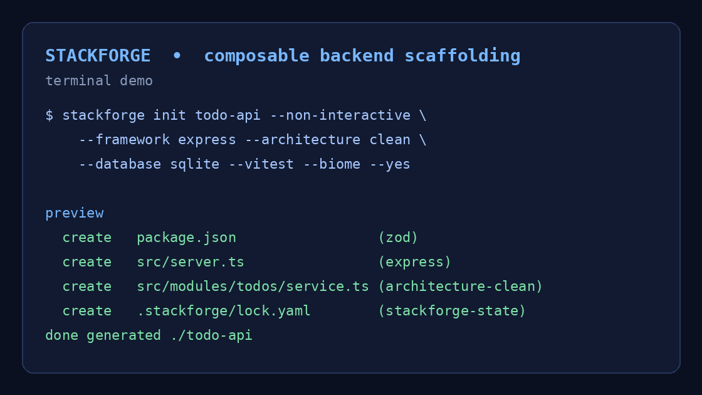

# Scafflare

[](https://github.com/captaincode-tech/scafflare/actions/workflows/ci.yml)
[](https://github.com/captaincode-tech/scafflare/actions/workflows/release.yml)
[](https://www.rust-lang.org/)
[](LICENSE)
[](https://t.me/captaincode_tech)

**English** | [فارسی](README.fa.md)

**Scafflare** is a fast, standalone Rust CLI for generating Node.js/TypeScript backends from composable YAML recipes. Its core is language- and framework-neutral: Express, Hono, Drizzle, and quality tooling are recipes rather than hard-coded core dependencies.

> **Secure by default:** recipes are data. Scafflare never executes external commands automatically; declared validation commands can run only when the user explicitly supplies `--run-commands`.



## Installation

### Build from source

Building from source requires Rust Stable 1.75 or later.

```bash
git clone https://github.com/captaincode-tech/scafflare.git
cd scafflare
cargo build --release
./target/release/scafflare --help
```

### Release binaries

Versioned Linux, macOS, and Windows archives will be attached to GitHub Releases after a maintainer pushes a verified version tag such as `v0.1.0`. Each archive is accompanied by the `SHA256SUMS` checksum manifest. No release has been published yet.

## Quick start

Generate a complete Express backend with Clean Architecture, SQLite/LibSQL, and Drizzle:

```bash
scafflare init todo-api \
  --non-interactive \
  --set framework=express \
  --set architecture=clean \
  --set database=sqlite \
  --set pino_enabled=true \
  --set vitest_enabled=true \
  --set biome_enabled=true \
  --set hooks_enabled=true \
  --set github_actions_enabled=true \
  --yes

cd todo-api
npm install
npm run db:push
npm run typecheck
npm run lint
npm test
npm run build
npm run dev
```

For the interactive wizard, run `scafflare init todo-api`. Scafflare displays a file preview before making changes. Automation must explicitly opt in with `--yes`.

## Commands

| Command | Purpose |
|---|---|
| `scafflare init <project-name>` | Create a project with the wizard or non-interactive flags. |
| `scafflare add <recipe...>` | Add recipes to a managed project. |
| `scafflare remove <recipe>` | Safely remove a recipe and exclusively owned, unmodified files. |
| `scafflare list` | List bundled recipes. |
| `scafflare doctor` | Check Node.js, npm, and the project lockfile. |
| `scafflare validate` | Validate the lockfile and versions of installed recipes. |
| `scafflare recipe validate <path>` | Validate a `recipe.yaml` and its referenced templates. |

Global `--json` and `--quiet` options support CI and automation. `--json` writes only machine-readable output to stdout. `--run-commands` runs array-form YAML validation commands after a successful commit; shell-like string commands are never executed.

## Official recipes for 0.1

| Category | Recipes |
|---|---|
| Runtime and language | `node`, `typescript` |
| HTTP | `express`, `hono` |
| Architecture | `architecture-minimal`, `architecture-layered`, `architecture-clean` |
| Data | `sqlite-libsql`, `drizzle` |
| Features | `zod`, `pino` |
| Quality | `vitest`, `biome`, `husky-lint-staged`, `github-actions` |

Selecting **Clean + SQLite** automatically adds `zod` and generates a working Todo CRUD flow through `Route → Controller → Service → Repository Interface → Drizzle Repository → Database`.

## Authoring a recipe

A recipe is a directory containing `recipe.yaml` and templates under `templates/`:

```text
recipes/custom/example/
├── recipe.yaml
└── templates/
    └── src/example.ts.jinja
```

```yaml
schema_version: 1
metadata:
  name: example
  version: 0.1.0
  description: An example extension
variables:
  enabled: true
depends_on: [typescript]
conflicts: []
files:
  - source: templates/src/example.ts.jinja
    destination: src/example.ts
    strategy: create
    when: "enabled"
validation_commands:
  - [npm, run, typecheck]
post_generation_instructions:
  - Review the generated example module.
```

`source` and `destination` paths must be relative and must not contain `..`, absolute paths, or Windows path prefixes. Supported strategies are `create`, `replace`, `merge_json`, `skip`, and `fail`. `merge_json` always performs a structured merge and never uses string injection in `package.json` or `tsconfig.json`.

Validate a local recipe with:

```bash
scafflare recipe validate recipes/custom/example/recipe.yaml
```

Read the [architecture guide](docs/architecture.md) and [recipe-authoring guide](docs/recipe-authoring.md) for the generation lifecycle, lockfile, and recipe contract.

## Development and quality gates

```bash
cargo fmt --all -- --check
cargo clippy --workspace --all-targets -- -D warnings
cargo test --workspace
cargo build --workspace --release
scripts/verify-fixtures.sh
cargo audit
```

CI runs the Rust gates and release build on Linux, macOS, and Windows. It also validates every official recipe and generates six supported Node.js/TypeScript fixtures; each fixture is installed, audited with `npm audit --omit=dev`, type-checked, linted, tested, and built. See the current [validation report](docs/validation-report.md).

## Security

See [SECURITY.md](SECURITY.md) for reporting guidance and the recipe threat model. In short, Scafflare rejects absolute paths, `..`, Windows prefixes, and paths outside the project sandbox. External commands are shown but not run unless the user explicitly opts in with `--run-commands`; shell-form commands are not executable. The MVP deliberately excludes an online registry and script hooks.

## MVP scope and limitations

Online registries, signature verification, native plugins, Laravel/Python/Go recipes, Prisma, and Docker are intentionally outside the `0.1.0` scope. The registry abstraction and bundled recipes provide the basis for later development. Recipe removal intentionally does not remove package-manager dependencies from manifests, which prevents unsafe removal of shared dependencies.

## Contributing

Contributions are welcome. Please read [CONTRIBUTING.md](CONTRIBUTING.md), follow the [Code of Conduct](CODE_OF_CONDUCT.md), and review the [changelog](CHANGELOG.md) before opening a pull request. For security issues, use the private reporting process in [SECURITY.md](SECURITY.md), not a public issue.

## License

Scafflare is released under the [MIT License](LICENSE).
